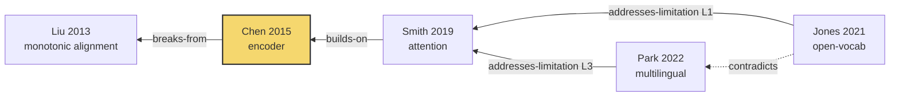

# Note templates

Use these exactly. Frontmatter keys are stable so the user can write Dataview queries against them.

Conventions: `citekey` is the Better BibTeX key without `@`. Filenames are the citekey. `generation` is 0 for seeds, −1 for their ancestors, and so on — always relative to the original seeds, even when a paper is added to the vault later from some other node. Limitation IDs are `L1`, `L2`... for limitations stated by the paper's own authors; `U1`, `U2`... for limitations the user noticed themselves (see "Log a limitation you noticed" in SKILL.md) — never merge the two sequences, the prefix is what tells a reader whose judgment it is. Both are unique within a note and referenced across notes the same way: `smith2019::L2`, `smith2019::U1`.

`zotero` is normally `"@<citekey>"`, read back after the skill adds the paper to Zotero (see step 4 of the loop). The one other valid value is `not-added` — only when no write-capable Zotero MCP was available for that paper; that paper's citekey is then self-derived (`lastname+year`) instead of Zotero-assigned, and it must also be listed as a coverage gap in `_Hub.md`.

---

## Papers/<citekey>.md

```markdown
---
citekey: smith2019attention
zotero: "@smith2019attention"   # or `not-added` — see conventions above
doi: 10.1145/3292500
year: 2019
authors: [Smith, J., Chen, L.]
generation: -1
source: semantic-scholar
access: fulltext        # fulltext | metadata-only
tags: [literature, gen--1]
---

# Smith & Chen 2019 — Attention-based sequence alignment

## Problem
One or two sentences. What was broken before this paper.

## Contribution
What is actually new. Distinguish the claim from the evidence.

## Method
One line.

## Stated limitations
Authors' own words, paraphrased, with location so the user can verify.

- **L1: Fixed vocabulary assumption.** Cannot handle out-of-vocabulary input. (§6, "Limitations")
  → addressed by [[jones2021open]] — `addresses-limitation`
- **L2: Quadratic memory in sequence length.** Acknowledged, not solved. (§6)
  → **open as of 2026** — see [[_Frontier]]
- **L3: English-only evaluation.** (§5.1, noted in passing)
  → partially addressed by [[park2022multi]] — three languages, still Indo-European

## Limitations not stated by the authors
Only include what you can actually support from the text, from a citing paper's critique, or from the user's own reading. Attribute every entry, and give it a `U#` id if it's the user's own observation — never fold it into the `L#` sequence above.

- Baseline predates [[liu2018strong]] by two years; the comparison is weak. (noted by [[jones2021open]] §2)
- **U1: Training data license is unclear despite claims of "open" release.** (noted by user, 2026-09-10)

## Ancestry
- `builds-on` [[chen2015enc]] — inherits the encoder architecture wholesale, replaces the training objective
- `breaks-from` [[liu2013align]] — explicitly rejects Liu's monotonic alignment assumption (§2, ¶3)
- `borrows-method-from` [[vaswani2017]] — attention mechanism, different problem domain

## Descendants
- [[jones2021open]] — `addresses-limitation` L1

## Notes
Your own reading. Keep separate from the extraction above so the user can tell them apart.
```

---

## Limitations/<slug>.md

Create only when a limitation recurs across three or more papers. The point is that Obsidian's graph then shows every paper touching this problem at once.

```markdown
---
type: limitation
slug: quadratic-memory
status: open        # open | partially-addressed | resolved
first-stated: 2015
tags: [limitation, frontier]
---

# Quadratic memory in sequence length

## What the problem is
Two or three sentences, no jargon.

## History
Entries can cite either an `L#` (author-stated) or a `U#` (user-noted) — mix freely, the history is about recurrence, not source.

- 2015 — [[chen2015enc]] L4 — first acknowledged, called a minor engineering concern
- 2019 — [[smith2019attention]] L2 — restated, now the binding constraint
- 2022 — [[park2022multi]] L1 — restated, workaround via chunking, not a solution
- 2023 — [[wong2023]] U1 — user-noted, same constraint under a different name in §4

## Attempted solutions and why they fall short
- Chunking ([[park2022multi]]) — breaks long-range dependencies, the original motivation

## Status
Open. Ten years from first statement to now, three restatements, no solution that preserves the property the field cares about.
```

---

## _Frontier.md

The deliverable that matters most for writing a related-work section.

```markdown
---
type: frontier
updated: 2026-09-10
---

# Open limitations

Limitations stated by authors and not resolved by anything traced in this vault. Absence of a fix here means nothing was found along these branches — not that nothing exists. Verify with a forward citation search before claiming novelty in print.

## Durable — restated across 3+ papers
- [[quadratic-memory]] — 2015→2022, three restatements, no solution

## Open, single statement
- [[smith2019attention]] L3 — English-only evaluation; partially addressed, still narrow

## Resolved during tracing
- [[smith2019attention]] L1 → [[jones2021open]]
```

---

## _Hub.md

Write this last. The graph view shows connection but never explains it; this is where the argument lives.

```markdown
---
type: hub
topic: Neural sequence alignment
seeds: [smith2019attention, park2022multi]
depth: 2
traced: 2026-09-10
---

# Neural sequence alignment — genealogy

## The short version
2–3 sentences, hard cap. Not a paragraph. If it doesn't fit, it belongs in "The trunk" or "Lineages," not here — this section is only so a reader knows what they're looking at before the graph.

## Genealogy graph
The overview once there's more than a couple of branches — read this before the prose below, not after.



Rules for this graph:
- One node per confirmed paper, `citekey` as the node id — no unverified leads, they don't get nodes.
- Arrow direction matches the `Ancestry` section of each paper's note: descendant → ancestor, so `A -->|builds-on| B` means A's note says `builds-on [[B]]`. Read the arrows as "points to what it came from," same direction the whole vault already uses.
- Label every edge with its type from the fixed vocabulary (step 5 of the loop). No unlabeled edges — that's the thing this whole skill exists to avoid.
- `contradicts` edges are dashed (`-.->`) and styled red — they should be visually impossible to miss even in a dense graph.
- Class the trunk node(s) — the convergence point(s) from step 6 — so they're visually distinct from everything else.
- Past ~15–20 nodes, split into one `mermaid` block per major thread instead of one giant graph; say so under the block ("split at the [[chen2015enc]] convergence for readability").

## The trunk
Where branches converged. [[chen2015enc]] was reached from both seeds independently — the common ancestor of this area.

## Lineages
Prose per thread, same order as the graph. With more than 3–4 threads, give full narrative only to the trunk and any thread with a contradiction or an open durable limitation; for the rest, one sentence is enough — the graph already carries the shape, this section only needs to carry what the graph can't say: *why*.

### Thread 1: alignment assumptions
[[liu2013align]] → [[chen2015enc]] → [[smith2019attention]] → [[jones2021open]]

Narrative prose. What each step inherited, what it threw away, why. This is the part that becomes your related-work section.

## Contradictions
[[park2022multi]] reports the opposite sign of effect from [[jones2021open]] on the same benchmark, without addressing the discrepancy.

## Coverage gaps
- [[wong2016]] paywalled, metadata only — its bibliography is unread, so its ancestors are missing
- Thread 2 stopped at depth 1 by user decision

## Unverified leads
Plausible but unconfirmed — search these yourself, they are not linked and have no notes.
- Possible earlier work on monotonic alignment in speech recognition, pre-2010
```
